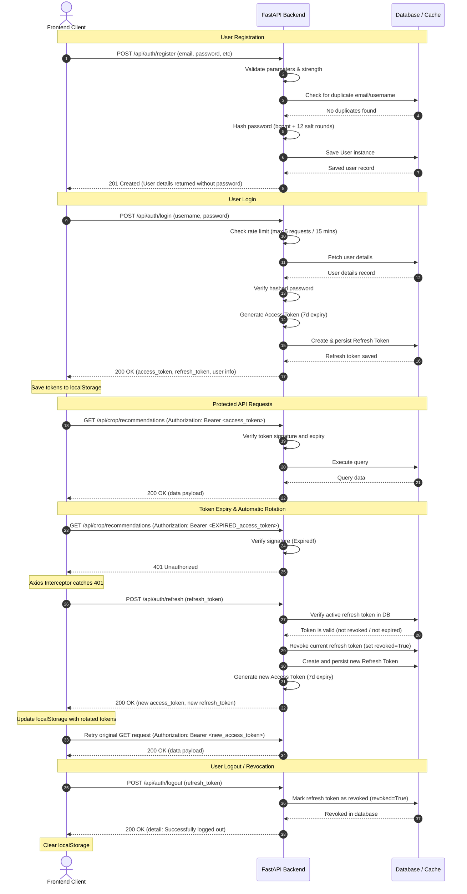

# SmartFarm AI - JWT Flow

This document details the lifecycle, structure, and sequence logic of the JSON Web Token (JWT) system.

## JWT Lifetimes
* **Access Token:** 7 days expiry. Sent in headers: `Authorization: Bearer <access_token>`
* **Refresh Token:** 30 days expiry. Sent in JSON body on token refresh.

---

## Complete Authentication Sequence

The diagram below illustrates user registration, credential validation, API calls using the Bearer token, and automatic token refresh rotation.

